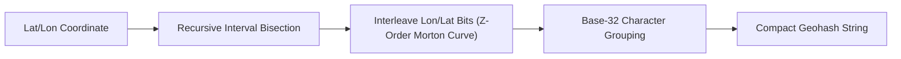

# Geohash Spatial Encoding Skill

Hierarchical Z-order curve space-filling spatial hashing engine in standard base32.

## Features
- **100% Python Standard Library**: Bitwise interval subdivision.
- **Prefix Locality**: Shared prefixes correspond to spatial proximity.
